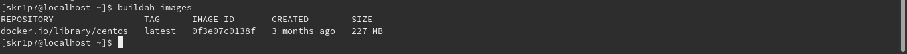
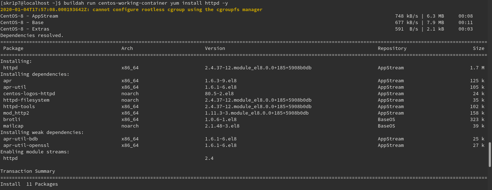
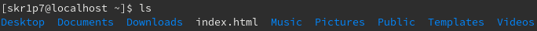
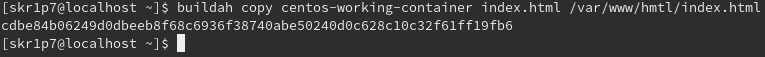
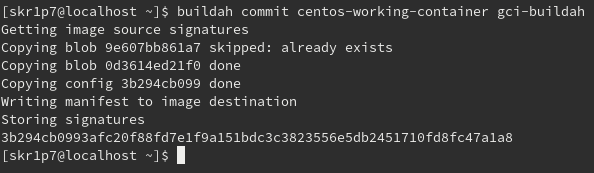

# Buildah 101

## In this walkthrough, we will create an Apache server image and serve a simple html file, here **index.html**. Let's get started! 

### Installation

To begin with, firstly we need to install Buildah, as I am using Fedora Workstation for this task, the command goes like:

```bash
$ yum install buildah -y
```

Likewise for Debian based OS like Ubuntu, we need to first serve the repository with the pipeline so that we can install Buildah from terminal, use the following command to do so:

```bash
$ sudo apt update
$ sudo apt install -y software-properties-common
$ sudo add-apt-repository -y ppa:projectatomic/ppa
$ sudo apt install buildah
```

Not to make it late, let's quickly check out our Buildah version using the following command:

```bash
$ buildah --version
```
### Working

Now let's see if we have any images by default, to get that done, use the following command:

```bash
$ buildah images
```
Which give us this as we do not have any images already:

```bash
$ buildah images
REPOSITORY  TAG  IMAGE ID  CREATED  SIZE
```

Up next let's choose a Linux distribution image which can be Fedora, CentOS, Ubuntu etc, here I will use CentOS, use the following command to pull CentOS image:

```bash
$ buildah from centos
```
Now let's install **httpd** to get some service up and running when we need it, use the following command to do so:

Let's try running ```buildah images``` command again and this is the output:



```bash
$ buildah run centos-working-container yum install httpd -y
```
It should look something like this:



Up next let's create a base html file, I'll call it **index.html**, use the following command:

```bash
$ echo "GCI Buildah" > index.html
```

Let's see if our **index.html** exists or not, simply ```ls``` from the same directory in the terminal.



Next we'll **index.html** to the directory path ```/var/www/html``` using the following command:

```bash
$ buildah copy centos-working-container index.html /var/www/html/index.html
```



Now we will configure the entrypoint for the container in order to start it, well use the following command to achieve our goal:

```bash
$ buildah config --entrypoint "/usr/sbin/httpd -DFOREGROUND" centos-working-container
```

Now without any further ado, let's wrap it all up whatever we've been doing in the container i.e. commit our work, use the following command to do so:

```bash
$ buildah commit centos-working-container gci-buildah
```


## That's it for us! Thanks


